# pyPANA Architecture Diagrams

This document provides visual representations of the pyPANA implementation architecture using Mermaid diagrams. These diagrams help developers understand the system structure, message flows, and component interactions.

## Table of Contents
- [System Overview](#system-overview)
- [PANA Protocol Message Flow](#pana-protocol-message-flow)
- [Class Architecture](#class-architecture)
- [State Machine Diagrams](#state-machine-diagrams)
- [Component Interaction](#component-interaction)
- [Security Architecture](#security-architecture)
- [EAP-TLS Integration](#eap-tls-integration)

## System Overview

### High-Level Architecture

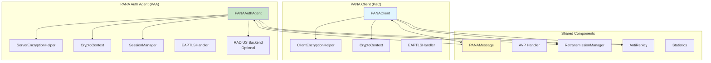

## PANA Protocol Message Flow

### Complete Authentication Flow (RFC 5191 Compliant)

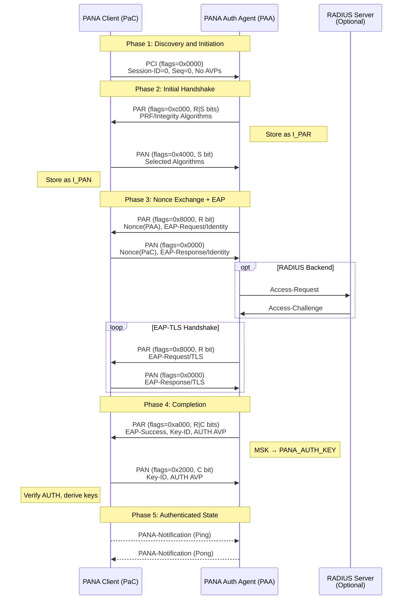

### Re-authentication Flow

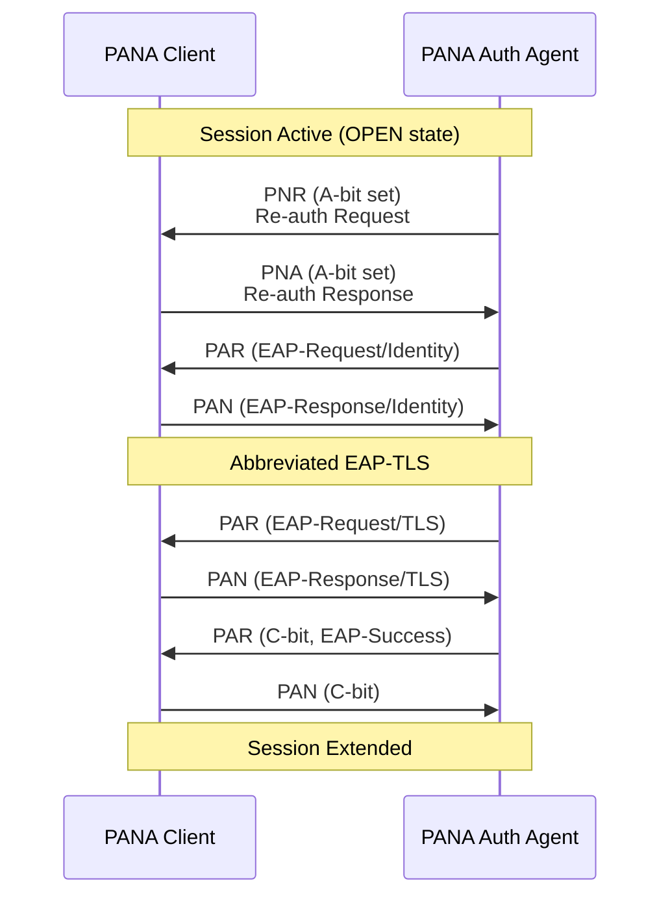

## Class Architecture

### Core Classes

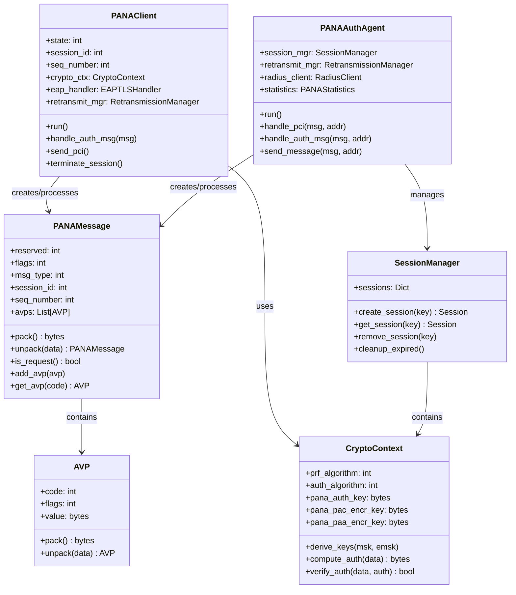

### Security Components

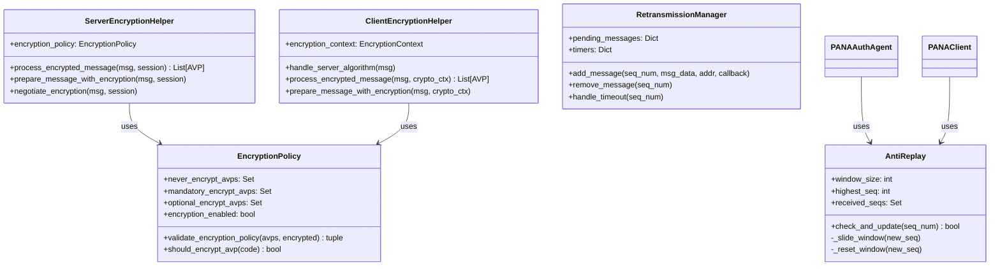

## State Machine Diagrams

### PaC (Client) State Machine

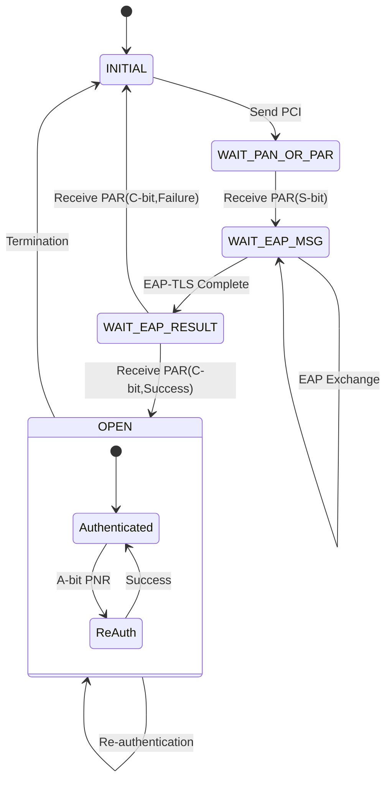

### PAA (Server) State Machine

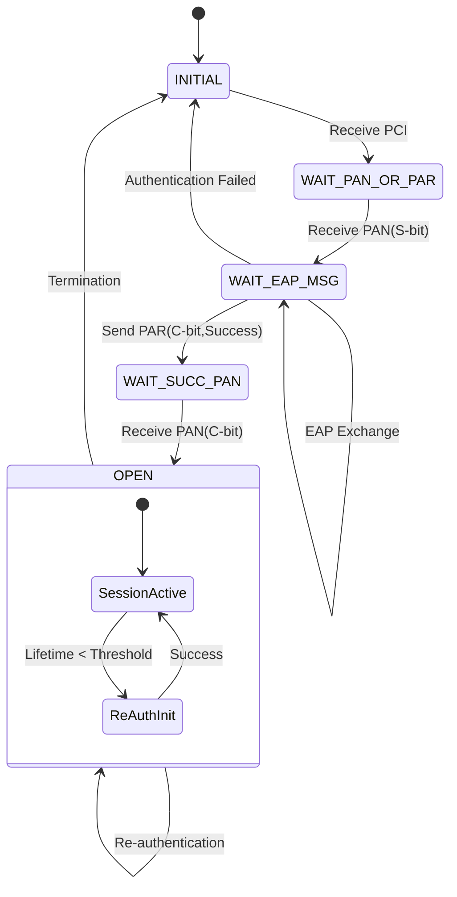

## Component Interaction

### Message Processing Flow

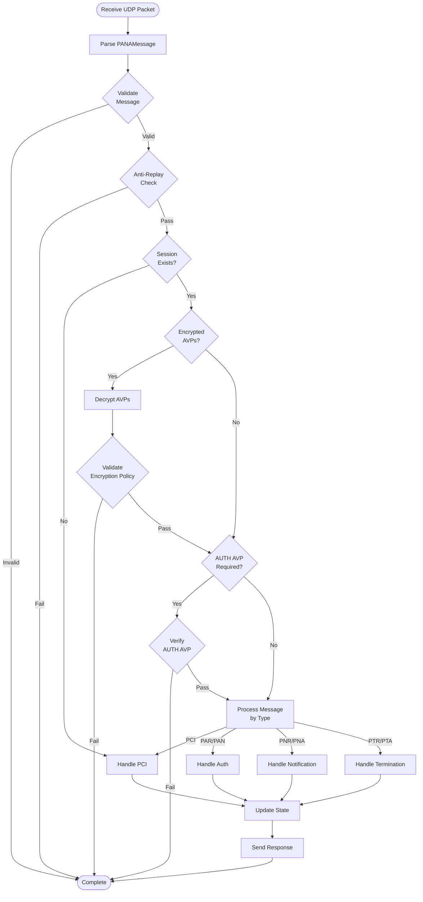

## Security Architecture

### Key Derivation Process

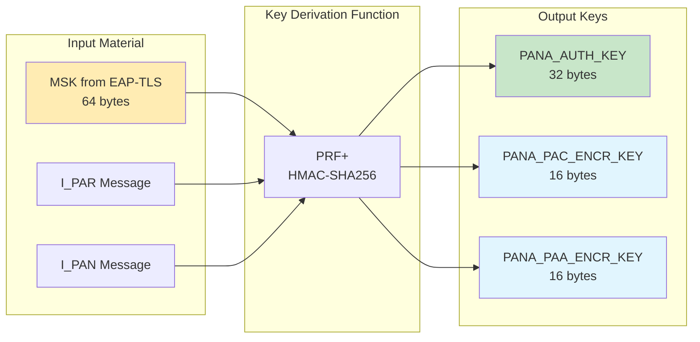

### Message Authentication

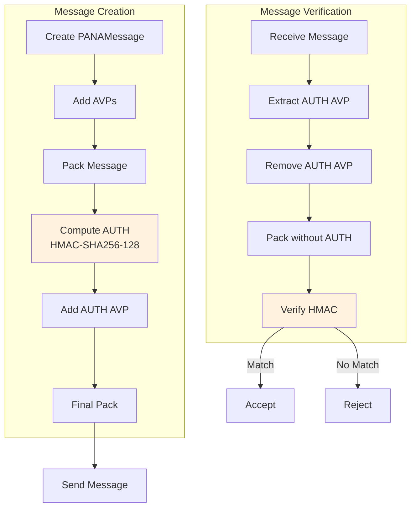

## EAP-TLS Integration

### EAP-TLS Handler Architecture

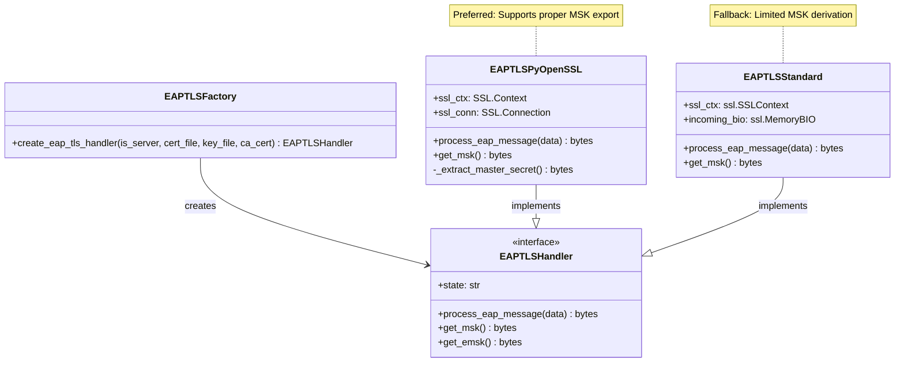

### EAP Message Flow

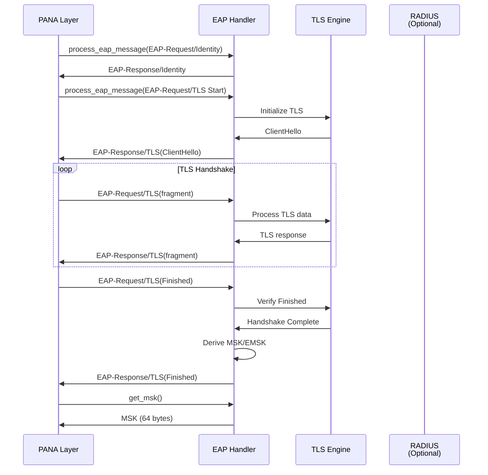

## RADIUS Integration

### RADIUS Backend Flow

```mermaid
flowchart TB
    subgraph "PAA with RADIUS"
        PAA[PANAAuthAgent]
        RH[RADIUS Handler]
        RC[pyrad.Client]
    end
    
    subgraph "RADIUS Server"
        RS[RADIUS Service]
        UDB[(User Database)]
    end
    
    PAC[PANA Client] -->|PAN(EAP-Response)| PAA
    PAA -->|Extract EAP| RH
    RH -->|Create Access-Request| RC
    RC -->|UDP 1812| RS
    RS -->|Validate| UDB
    RS -->|Access-Challenge| RC
    RC -->|Extract EAP| RH
    RH -->|Return EAP| PAA
    PAA -->|PAR(EAP-Request)| PAC
```

## Performance Considerations

### Session Management

```mermaid
flowchart LR
    subgraph "Session Storage"
        HT[Hash Table<br/>O(1) lookup]
        SK[Session Key:<br/>(session_id, client_ip)]
    end
    
    subgraph "Cleanup Strategy"
        TC[Timer-based<br/>Cleanup]
        EC[Event-based<br/>Cleanup]
        MC[Memory<br/>Threshold]
    end
    
    subgraph "Optimization"
        CP[Connection<br/>Pooling]
        CB[Circular<br/>Buffer]
        LRU[LRU Cache<br/>Statistics]
    end
    
    SK --> HT
    HT --> TC
    HT --> EC
    HT --> MC
    
    TC --> CP
    EC --> CB
    MC --> LRU
```

## Summary

The pyPANA architecture follows a modular design with clear separation of concerns:

1. **Protocol Layer**: Handles PANA message format and state machines
2. **Security Layer**: Manages cryptographic operations and key derivation
3. **EAP Layer**: Provides pluggable authentication methods (currently EAP-TLS)
4. **Transport Layer**: UDP socket management with retransmission
5. **Management Layer**: Session lifecycle, statistics, and monitoring

The implementation prioritizes:
- RFC compliance (RFC 5191, RFC 6786, RFC 5216)
- Security (proper key derivation, anti-replay, encryption)
- Extensibility (pluggable EAP methods, RADIUS backend)
- Performance (efficient session management, connection pooling)